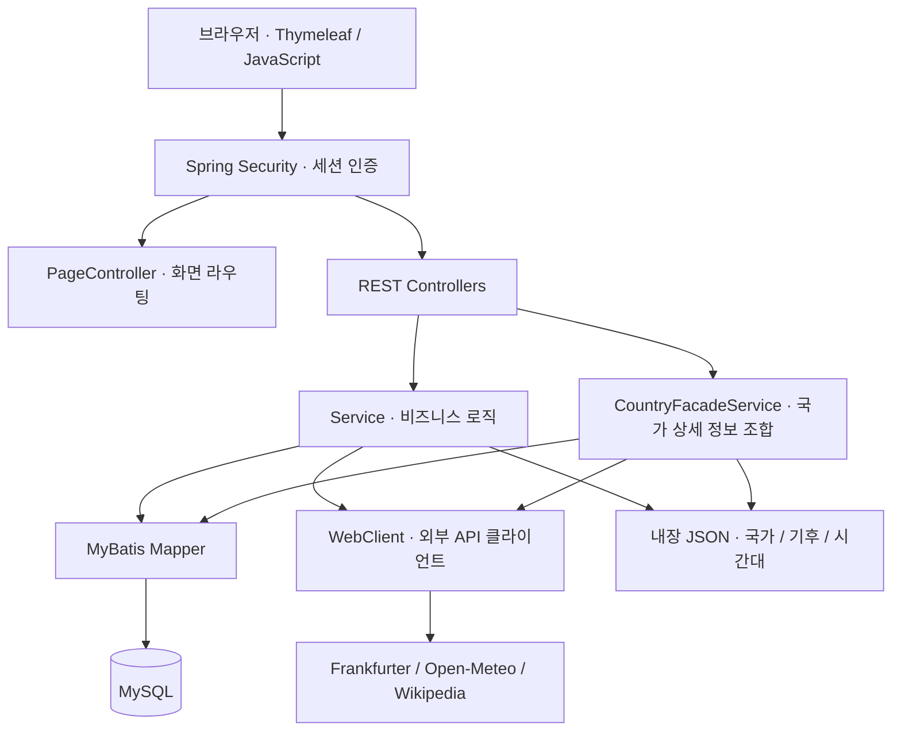

<div align="center">

# 🧭 Travel Compass

**여행지를 찾는 순간부터, 떠나기 전 준비까지 한 곳에서.**

세계지도 탐색 · 국가 정보 · 여행 준비물 · 예산 계산 · 여행 후기


[주요 기능](#주요-기능) · [기술 스택](#기술-스택) · [설계](#아키텍처) · [실행 방법](#실행-방법) · [트러블슈팅](#트러블슈팅)

</div>

---

## 프로젝트 소개

**Travel Compass**는 여행지 정보 탐색과 개인별 여행 준비를 연결하는 여행 정보 통합 웹 서비스입니다. 세계지도나 국가명 검색으로 여행지를 찾고, 국가별 환율·시차·날씨·평균 기후·주변 명소를 확인할 수 있습니다. 관심 국가는 즐겨찾기에 저장하고, 체크리스트와 예산 계산기로 여행을 준비하며, 후기로 경험을 공유합니다.

> **이용 흐름** — 회원가입 및 로그인 → 여행지 탐색 → 국가 정보 확인 → 준비물·예산 관리 → 후기 공유

## 주요 기능

| 기능 | 제공 내용 |
| :--- | :--- |
| 🗺️ **지도 탐색·국가 검색** | 세계지도에서 국가 선택, 한글·영문 국가명 검색 |
| 🌏 **국가 상세 정보** | 국가 기본 정보, 환율, 시간대, 날씨 예보, 평균 기후 및 주변 명소 조회 |
| ⭐ **즐겨찾기** | 회원별 관심 국가 등록·조회·삭제 및 중복 등록 방지 |
| ✅ **여행 체크리스트** | 준비물 등록·수정·삭제, 준비 완료 여부 관리 |
| 💱 **예산 계산기** | 통화 간 환율 조회 및 환율 기반 여행 예산 계산 |
| ✍️ **여행 후기·댓글** | 국가별 후기 조회, 평점·후기 및 댓글 작성·수정·삭제 |
| 🔐 **회원 관리** | 회원가입, 세션 기반 로그인·로그아웃, BCrypt 비밀번호 해싱 |

현재 보안 설정에서는 회원가입·로그인 및 허용된 정적 리소스를 제외한 모든 경로에 **로그인이 필요**합니다.

## 기술 스택

| 영역 | 기술 |
| :--- | :--- |
| **언어·런타임** | Java 21 |
| **백엔드** | Spring Boot 3.5.16, Spring MVC, WebClient(WebFlux) |
| **화면** | Thymeleaf, JavaScript, Tailwind CSS, Leaflet |
| **데이터베이스** | MySQL, MyBatis |
| **인증·검증** | Spring Security, Bean Validation |
| **빌드·테스트** | Gradle Wrapper, JUnit 5, Mockito, Spring Security Test |

### 데이터 소스

| 데이터 | 소스 | 처리 방식 |
| :--- | :--- | :--- |
| 국가 기본 정보·한글명 | 내장 JSON | 외부 호출 없이 로컬 데이터 조회 |
| 평균 기후 | 내장 JSON | 애플리케이션 시작 시 메모리 로딩 |
| 시간대 | 내장 JSON 및 Java 시간 API | 국가별 시간대 정보 처리 |
| 환율 | Frankfurter API | WebClient로 조회 |
| 날씨 예보 | Open-Meteo API | 좌표 기반 조회 |
| 주변 명소 | Wikipedia GeoSearch API | `WikidataClient`에서 좌표 기반 조회 |

## 아키텍처



### 주요 설계 포인트

- **화면과 데이터 요청 분리** — `PageController`는 Thymeleaf 화면을 반환하고, REST 컨트롤러는 화면에서 사용하는 데이터를 제공합니다.
- **국가 상세 정보 통합** — `CountryFacadeService`가 국가 정보·명소·날씨·환율·기후·즐겨찾기 여부를 하나의 응답으로 조합합니다.
- **독립적인 조회 병렬 처리** — `Mono.zip`으로 상세 정보 조회를 조합하고, 블로킹 DB 조회는 `boundedElastic` 스케줄러에서 실행합니다. 최종 응답은 Spring MVC 흐름에서 동기적으로 반환합니다.
- **일부 조회 실패에 대한 대체값 처리** — 국가 상세 조회에서 명소·날씨·환율 조회 오류에 빈 응답을 사용합니다. 전체 조합에는 10초 대기 제한이 있습니다.
- **공통 응답·예외 처리** — `ApiResponse<T>`와 `BusinessException`, `GlobalExceptionHandler`로 업무 API의 응답 및 오류 처리 방식을 통일합니다.
- **회원별 데이터 접근 제어** — 개인 데이터의 수정·삭제 시 회원 ID를 확인하고, 즐겨찾기는 회원·국가 코드 조합의 유일 제약으로 중복을 방지합니다.

## 실행 방법

### 1. 사전 준비

**JDK 21**, **MySQL**, **Git**이 필요합니다. Gradle은 저장소의 Wrapper를 사용합니다.

```bash
git clone https://github.com/baesu123/travelcompass.git
cd travelcompass
```

### 2. 데이터베이스 설정

MySQL에서 데이터베이스를 생성하고, 해당 DB에 접근 및 테이블 생성 권한이 있는 계정을 준비합니다.

```sql
CREATE DATABASE travelcompass CHARACTER SET utf8mb4;
```

`src/main/resources/application-local.yaml` 파일을 생성하고 자신의 DB 접속 정보를 입력합니다. 이 파일은 `.gitignore`에 포함되어 있습니다.

```yaml
spring:
  datasource:
    url: jdbc:mysql://localhost:3306/travelcompass?serverTimezone=Asia/Seoul&characterEncoding=UTF-8
    username: YOUR_DB_USERNAME
    password: YOUR_DB_PASSWORD
```

### 3. 애플리케이션 실행

**Windows · PowerShell**

```powershell
.\gradlew.bat bootRun
```

**macOS · Linux**

```bash
./gradlew bootRun
```

실행 후 [로컬 로그인 화면](http://localhost:8080/login)에 접속해 회원가입 후 이용합니다.

기본 프로필은 `local`이며, 실행 시 `db/schema.sql`과 `db/data.sql`이 자동 적용됩니다. 테이블은 없을 때 생성하며, 샘플 데이터는 ID가 1인 회원이 존재할 때 일부 체크리스트 항목을 추가합니다.

<details>
<summary><strong>프로덕션 프로필로 실행하기</strong></summary>

별도의 DB 접속 설정을 `application-prod.yaml` 또는 환경 변수로 준비한 뒤 실행합니다.

```bash
./gradlew bootRun --args='--spring.profiles.active=prod'
```

Windows에서는 `./gradlew` 대신 `.\gradlew.bat`를 사용합니다. 공통 설정의 SQL 초기화 모드는 `always`이므로, 운영 환경의 초기화 정책에 맞춰 프로덕션 설정에서 조정해야 합니다.

</details>

## 테스트

서비스와 외부 API 클라이언트 테스트, 애플리케이션 컨텍스트 로딩 테스트를 포함합니다. 즐겨찾기의 국가 코드 정규화·중복 등록·소유권 검증 등 주요 동작을 검증합니다.

```powershell
# Windows
.\gradlew.bat test
```

```bash
# macOS / Linux
./gradlew test
```

전체 테스트 중 `@SpringBootTest`는 DB 연결이 필요하므로 실행 방법의 DB 설정을 먼저 완료합니다. 테스트 코드는 [src/test/java](src/test/java/com/example/travelcompass)에서 확인할 수 있습니다.

## 프로젝트 구조

```text
src/
├── main/
│   ├── java/com/example/travelcompass/
│   │   ├── controller/    # 화면 라우팅 및 REST API
│   │   ├── service/       # 비즈니스 로직 및 국가 상세 정보 조합
│   │   ├── client/        # 외부 API 및 국가 데이터 조회
│   │   ├── mapper/        # MyBatis 인터페이스 및 응답 변환
│   │   ├── entity/        # 도메인 객체
│   │   ├── dto/           # 요청·응답 DTO
│   │   ├── config/        # 인증 및 WebClient 설정
│   │   └── common/        # 공통 응답 및 예외 처리
│   └── resources/
│       ├── data/          # 국가·한글명·시간대·기후 JSON
│       ├── db/            # 스키마 및 초기 데이터 SQL
│       ├── mapper/        # MyBatis SQL XML
│       ├── static/        # CSS, JavaScript, 지도 데이터
│       ├── templates/     # Thymeleaf 화면
│       └── application.yaml
└── test/java/com/example/travelcompass/
    ├── client/            # 클라이언트 테스트
    └── service/           # 서비스 테스트
```

<details>
<summary><strong>페이지 경로 살펴보기</strong></summary>

| 경로 | 화면 |
| :--- | :--- |
| `/` | 세계지도 기반 홈 |
| `/country/{countryCode}` | 국가 상세 정보 |
| `/favorites` | 관심 국가 목록 |
| `/checklist` | 여행 준비물 체크리스트 |
| `/budget` | 여행 예산 계산기 |
| `/reviews` | 후기 목록 · `countryCode`로 국가별 필터링 |
| `/reviews/{reviewId}` | 후기 상세 및 댓글 |
| `/login` | 로그인 |
| `/signup` | 회원가입 |

</details>

## 트러블슈팅

### 국가 기본 정보의 외부 API 의존 줄이기

**문제** — 국가명·수도·통화 코드처럼 변경 빈도가 낮은 정보도 외부 서비스에 의존하면 네트워크 장애와 호출 제약의 영향을 받습니다.

**해결** — 국가 기본 정보를 내장 `countries.json`으로 제공하고 한글명은 별도 JSON으로 관리하도록 구성했습니다.

**결과** — 국가 기본 정보 조회에 필요한 외부 네트워크 호출을 제거했습니다. 환율·날씨·주변 명소는 계속 외부 API를 이용하며, 내장 데이터의 변경 사항은 별도로 갱신해야 합니다.

### 즐겨찾기 국가 코드의 대소문자 불일치

**문제** — 입력된 국가 코드와 저장된 코드의 대소문자가 다르면 중복 확인 및 조회에서 불일치가 발생할 수 있습니다.

**해결** — 즐겨찾기 등록 시 국가 코드를 대문자로 정규화한 뒤 중복 확인과 저장에 사용합니다.

**검증** — `FavoriteServiceImplTest`에서 소문자로 입력한 국가 코드가 대문자로 저장되는 동작과 중복 등록 거부를 확인합니다.
