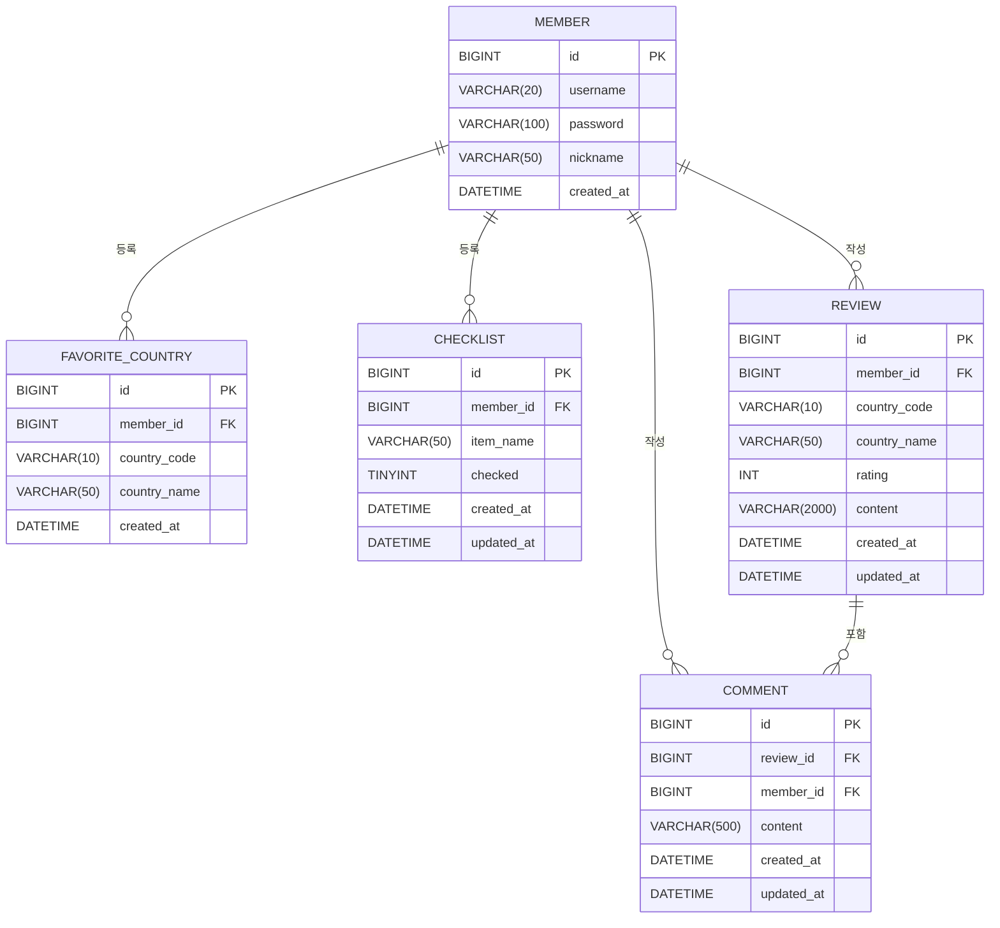
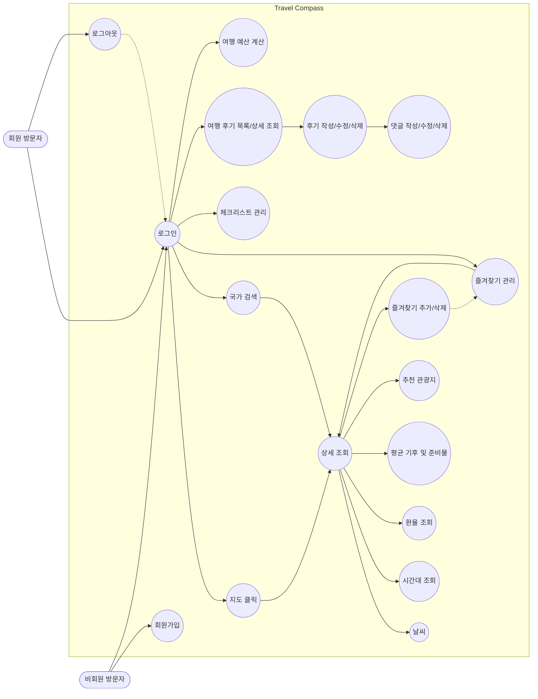

# Travel Compass 🧭

여행지 국가 정보(환율, 시차, 기후), 즐겨찾기, 여행 준비물 체크리스트, 예산 계산기, 여행 리뷰를 한 곳에서 제공하는 여행 정보 통합 웹 서비스입니다.

## 주요 기능

- **국가 검색/상세 정보**: 국가명(한글/영문)으로 검색하고, 국가의 기본 정보와 실시간 환율, 시차, 평균 기후 정보를 한 번에 확인
- **지도 기반 홈 화면**: 세계지도를 통해 국가를 시각적으로 탐색
- **즐겨찾기**: 관심 있는 국가를 즐겨찾기로 등록/조회/삭제
- **여행 준비물 체크리스트**: 개인별 준비물 목록 관리
- **여행 예산 계산기**: 환율 기반 예산 계산
- **여행 리뷰**: 국가별 여행 리뷰 작성 및 댓글
- **회원 관리**: 회원가입/로그인 (Spring Security 기반 세션 인증)

## 기술 스택

| 구분 | 기술 |
| --- | --- |
| Language | Java 21 |
| Framework | Spring Boot 3.5 (Web MVC, WebFlux) |
| View | Thymeleaf |
| Persistence | MyBatis, MySQL |
| Security | Spring Security (세션 기반 인증) |
| Build | Gradle |
| Test | JUnit 5, Mockito |
| 외부 연동 | Frankfurter API(환율), Open-Meteo API(기후), Wikidata/Wikipedia API |

## ERD



## 유스케이스 다이어그램



비회원은 회원가입/로그인만 가능하며, 로그인 이후에는 지도 탐색·국가 검색·상세 조회(날씨/시간대/환율/기후/관광지)·즐겨찾기/체크리스트 관리·후기 및 댓글 작성 등 모든 기능을 이용할 수 있습니다.

## 아키텍처 개요

- **Controller**: REST API(`@RestController`)와 화면 라우팅(`@Controller`, `PageController`)을 분리
- **Facade 패턴**: `CountryFacadeService`가 환율/시차/기후/즐겨찾기 서비스를 조합해 국가 상세 정보를 하나의 응답으로 제공
- **공통 응답 규격**: 모든 REST API는 `ApiResponse<T>`로 응답을 감싸서 반환
- **예외 처리**: `BusinessException` + `GlobalExceptionHandler`로 일관된 에러 응답 처리
- **외부 API 클라이언트**: `WebClient` 기반으로 국가/환율/기후/타임존 관련 외부 API 연동을 클라이언트 단위로 분리

## 프로젝트 구조

```
src/main/java/com/example/travelcompass/
├── TravelcompassApplication.java        # 스프링부트 진입점(main 메서드)
│
├── controller/                          # 화면/REST API 요청을 받는 컨트롤러 계층
│   ├── PageController.java              # Thymeleaf 화면 라우팅 전용 컨트롤러
│   ├── MemberController.java            # 회원가입/로그인 화면 처리
│   ├── CountryController.java           # 국가 검색/상세정보 REST API
│   ├── ExchangeController.java          # 환율 조회 및 예산 계산 REST API
│   ├── TimezoneController.java          # 국가별 시간대 조회 REST API
│   ├── FavoriteController.java          # 즐겨찾기 CRUD REST API
│   ├── ChecklistController.java         # 여행 준비물 체크리스트 CRUD REST API
│   └── ReviewController.java            # 여행지 리뷰/댓글 CRUD REST API
│
├── service/                             # 비즈니스 로직 계층
│   ├── CountryFacadeService.java        # 환율/시차/기후/즐겨찾기를 조합하는 파사드 서비스
│   ├── MemberService.java               # 회원가입/인증 로직(UserDetailsService 구현)
│   ├── ExchangeService.java             # 환율 조회 및 예산 계산 로직
│   ├── TimezoneService.java             # 시간대 계산/조회 로직
│   ├── ClimateService.java              # 지역별 평균 기후 정보 제공(정적 JSON 캐싱)
│   ├── FavoriteService(Impl).java       # 즐겨찾기 서비스 인터페이스/구현체
│   ├── ChecklistService(Impl).java      # 체크리스트 서비스 인터페이스/구현체
│   └── ReviewService(Impl).java         # 리뷰/댓글 서비스 인터페이스/구현체
│
├── client/                              # 외부 Open API 연동 클라이언트(WebClient 기반)
│   ├── RestCountriesClient.java         # 국가 기본 정보 제공(내장 정적 JSON)
│   ├── OpenMeteoClient.java             # Open-Meteo 날씨 예보 API 호출
│   ├── FrankfurterClient.java           # Frankfurter 환율 API 호출
│   └── WikidataClient.java              # 위키백과 GeoSearch API 호출(주변 명소 검색)
│
├── mapper/                              # MyBatis 매퍼 인터페이스(DB 접근)
│   ├── MemberMapper / FavoriteMapper / ChecklistMapper
│   └── ReviewMapper / CommentMapper / CountryMapper
│
├── entity/                              # DB 테이블과 매핑되는 도메인 객체
│   └── Member / FavoriteCountry / Checklist / Review / Comment
│
├── dto/
│   ├── request/                         # 요청 바디 DTO (회원가입, 즐겨찾기/체크리스트/리뷰/댓글 생성·수정, 예산 계산 등)
│   └── response/                        # 응답/외부 API 매핑 DTO (국가 상세, 환율, 시간대, 기후, 외부 API 매핑 등)
│
├── config/                              # 설정 클래스
│   ├── SecurityConfig.java              # Spring Security 설정(세션 기반 폼 로그인, BCrypt)
│   ├── WebClientConfig.java             # 외부 API 호출용 WebClient.Builder 빈 등록
│   └── MemberDetails.java               # 로그인 회원을 감싸는 UserDetails 구현체
│
└── common/                              # 공통 응답/예외 처리
    ├── response/ApiResponse.java        # 모든 REST 응답을 감싸는 공통 포맷(success/code/message/data)
    └── exception/                       # BusinessException, ErrorCode, GlobalExceptionHandler

src/main/resources/
├── mapper/                              # MyBatis XML(SQL 매핑) 5종
└── templates/                           # Thymeleaf 뷰
    ├── index.html                       # 메인 홈(지도 기반) 화면
    ├── fragments/nav.html               # 공통 네비게이션 바 조각(fragment)
    ├── member/login.html, member/signup.html
    ├── country/detail.html              # 국가 상세 정보 화면
    ├── favorite/list.html               # 즐겨찾기 목록 화면
    ├── checklist/list.html              # 체크리스트 화면
    ├── review/list.html, review/detail.html
    └── budget/calculator.html           # 여행 예산 계산기 화면
```

## 프로젝트 상세

- **PageController**: REST가 아닌 화면 라우팅 전용 컨트롤러. `/`, `/country/{code}`, `/favorites`, `/checklist`, `/reviews`, `/budget` 등의 경로를 Thymeleaf 뷰 이름으로 매핑
- **MemberController / MemberService**: 회원가입/로그인 화면 처리 및 Spring Security `UserDetailsService` 구현. 비밀번호는 BCrypt로 암호화해 저장/검증
- **CountryController / CountryFacadeService**: 국가 검색 API를 제공하고, 파사드 패턴으로 환율(Frankfurter)·기후·시차·즐겨찾기 여부 등 여러 서비스를 조합해 국가 상세 정보를 하나의 응답으로 반환
- **ExchangeController / ExchangeService**: 통화 간 환율 조회 및 환율 기반 여행 예산 계산 API 제공
- **TimezoneController / TimezoneService**: 국가 코드를 기준으로 시간대 정보를 조회
- **FavoriteController / FavoriteServiceImpl**: 로그인 회원의 즐겨찾기(관심 국가) 등록/조회/삭제, 국가 코드 대소문자를 통일해 조회 정합성 보장
- **ChecklistController / ChecklistServiceImpl**: 로그인 회원별 여행 준비물 체크리스트 등록/수정/삭제/조회
- **ReviewController / ReviewServiceImpl**: 국가별 여행 리뷰와 댓글 CRUD. 조회는 비로그인도 가능하고, 작성·수정·삭제는 로그인 회원만 가능
- **ClimateService**: 정적 JSON을 애플리케이션 시작 시 메모리에 캐싱해 지역별 평균 기후 정보를 빠르게 제공
- **RestCountriesClient**: 원래 RestCountries 외부 API를 사용했으나 API 정책 변경(키 인증 필수화)에 대응해 내장 정적 JSON(`countries.json`)으로 대체
- **OpenMeteoClient / FrankfurterClient / WikidataClient**: `WebClient` 기반으로 각각 날씨 예보, 환율, 주변 명소(위키백과 GeoSearch) 외부 API를 비동기 호출
- **ApiResponse\<T\>**: 모든 REST 응답을 `success/code/message/data` 형식으로 통일하는 공통 응답 래퍼
- **GlobalExceptionHandler / BusinessException / ErrorCode**: `@RestControllerAdvice`로 모든 예외를 가로채 일관된 `ApiResponse` 형태로 응답. 업무 예외는 `ErrorCode`를 담은 `BusinessException`으로 표현
- **SecurityConfig**: 세션 기반 폼 로그인 설정. `/login`, `/signup`, 정적 리소스만 비회원 접근을 허용하고 나머지는 인증 필요
- **WebClientConfig / MemberDetails**: 외부 API 호출용 `WebClient.Builder` 공통 빈 등록, 로그인 회원 정보를 감싸는 `UserDetails` 구현체

## 페이지 구성

| 경로 | 화면(템플릿) | 설명 |
| --- | --- | --- |
| `/` | `index.html` | 메인 홈(지도 기반) 화면, 로그인 시 닉네임 표시 |
| `/country/{countryCode}` | `country/detail.html` | 특정 국가의 상세 정보(환율·시차·기후·명소) 화면 |
| `/favorites` | `favorite/list.html` | 로그인 회원의 즐겨찾기 목록 화면 |
| `/checklist` | `checklist/list.html` | 여행 준비물 체크리스트 화면 |
| `/reviews` | `review/list.html` | 리뷰 목록 화면(`countryCode` 쿼리파라미터로 국가별 필터링) |
| `/reviews/{reviewId}` | `review/detail.html` | 리뷰 상세(댓글 포함) 화면 |
| `/budget` | `budget/calculator.html` | 여행 예산 계산기 화면 |
| `/login` | `member/login.html` | 로그인 화면 |
| `/signup` | `member/signup.html` | 회원가입 화면 |

## 트러블슈팅

### 1. 무료 API의 사용 제약 발생

**문제 상황**

- `restcountries.com` API의 정책 변경으로 호출 제한 가능성이 생김
- 인증 필수화, 트래픽 제한이 발생할 여지가 있어 서비스 안정성에 리스크로 작용

**해결 방법**

- 국가명, 수도, 대륙, 통화 코드, 전화번호 부호 등 자주 변하지 않는 국가 기본 정보를 프로젝트 내부에 정적 JSON(`countries.json`)으로 내장
- 외부 API 호출 없이 로컬 데이터를 읽어오는 방식으로 전환

**효과**

- 외부 서버 장애나 정책 변경에도 앱이 100% 정상 작동
- 변하지 않는 정적 데이터를 매번 외부 API로 조회하는 데 드는 네트워크 비용과 장애 리스크를 제거

### 2. 국가 코드 대소문자 불일치로 인한 즐겨찾기 조회 실패

**문제 상황**

- 즐겨찾기 여부 확인 시, 입력받은 국가 코드(소문자)를 그대로 사용하여 대문자로 저장된 DB 데이터와 일치하지 않아 조회가 실패하는 버그 발생

**해결 방법**

- 입력받은 2자리 국가 코드를 대문자로 통일해 DB를 조회/저장하도록 수정
- Mockito를 활용한 단위 테스트로 정상 동작을 검증한 뒤 최종 적용

## 실행 방법

```bash
# 로컬 프로필로 실행 (기본값)
./gradlew bootRun

# 프로덕션 프로필로 실행
./gradlew bootRun --args='--spring.profiles.active=prod'
```

애플리케이션 실행 시 `schema.sql`, `data.sql`이 자동으로 적용됩니다.
